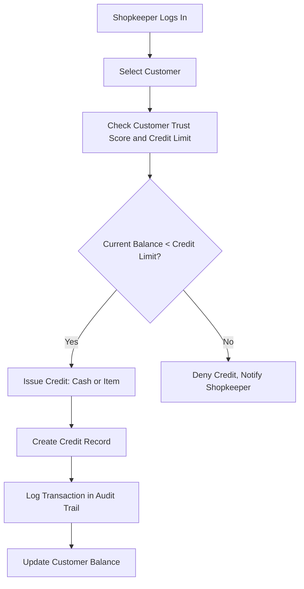
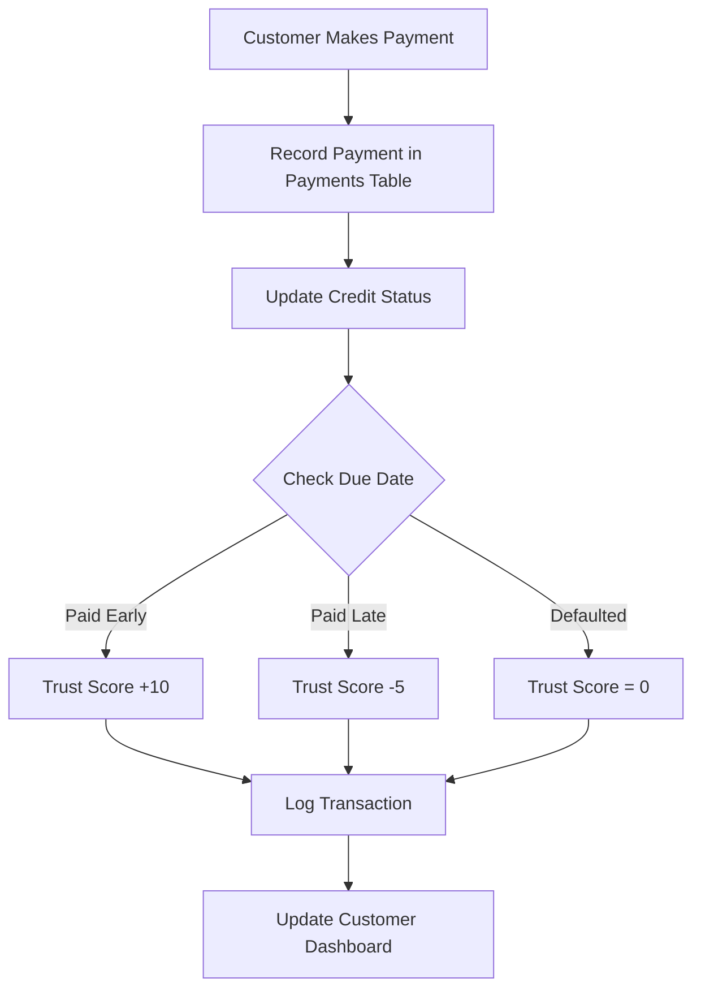

# Digital Credit Ledger & Scoring System Design Document

## Executive Summary
This system digitizes the informal "Deni" (Credit) culture in Tanzania. It provides small businesses (SMEs) with a platform to manage individual/business loans, track repayments, and build a "Financial Identity." The goal is to provide a "Digital Statement" that businesses can eventually use to prove their creditworthiness to banks.

## System Logic & Core Features

### A. The "Smart" Credit Engine
- **Trust Scoring**: A dynamic calculation based on repayment behavior.
  - Paid Early: +10 points.
  - Paid Late: -5 points.
  - Defaulted: Score resets to 0.
- **Automated Risk Management**: The system prevents new credit if the Current_Balance exceeds the Credit_Limit.

### B. Transactional Integrity
- **Audit Trail**: Every movement of money (Issuance, Payment, Adjustment) creates an immutable record in the transactions table.
- **Balance Reconciliation**: Total Debt is calculated as (Principal + Interest) - Total Payments.

## Core Entities and Relationships

### Entities
- **User**: The Shopkeeper/Admin (id, name, email, shop_name, password).
- **Customer**: The Borrowers (id, name, phone, trust_score, credit_limit).
- **Credit**: The Debt records (id, customer_id, amount, type (cash/item), status, due_date).
- **Payment**: Repayment history (id, credit_id, amount_paid, method (M-Pesa/Cash)).
- **Transaction**: The Audit Log (id, user_id, type (debit/credit), amount, reference_id).

### Relationships
- User manages many Customers
- Customer has many Credits
- Credit has many Payments
- Transaction logs all financial activities

## Database Schema

### Tables
- users: id, name, email, shop_name, password
- customers: id, name, phone, trust_score, credit_limit, current_balance
- credits: id, customer_id, amount, type, status, due_date, created_at
- payments: id, credit_id, amount_paid, payment_date, method
- transactions: id, user_id, type, amount, reference_id, created_at

## Logical Flow Diagrams

### I. Credit Issuance Logic

### II. The Repayment & Scoring Logic

### Business Health Metrics
- **Repayment Rate**: (Paid Credits / Total Credits) * 100.
- **Portfolio at Risk (PAR)**: Total value of debts past due_date.
- **Cash-Flow Summary**: Monthly "Total Issued" vs. "Total Collected."

## Security Strategy
- **SQL Injection Prevention**: Handled by Laravel Eloquent.
- **Data Consistency**: Using DB::transaction for atomic operations.
- **RBAC**: Shopkeeper sees Bank Report; customers see Personal Statement.

## Development Roadmap
- **Phase 1**: Setup Laravel & Database Migrations.
- **Phase 2**: CRUD for Customers and Credits.
- **Phase 3**: Trust Scoring Algorithm.
- **Phase 4**: Reporting Dashboard and PDF Export.

## Next Steps
This design incorporates the provided specification. Implementation will follow in Code mode after approval.